# Manual vs AI Count Comparison

The `manual_comparison` package compares human expert counts against CGRAS AI counts for coral settler tiles. It matches manual count sheets (from Excel) to AI count files by tile ID and capture date, computes a comprehensive set of statistical metrics, and produces per-tile figures and an aggregate summary table.

---

## Table of contents

1. [Inputs](#inputs)
2. [Usage](#usage)
3. [Output structure](#output-structure)
4. [Metrics reference](#metrics-reference)
5. [Per-pair figures](#per-pair-figures)
6. [Aggregate figures](#aggregate-figures)
7. [Summary table](#summary-table)
8. [Module overview](#module-overview)

---

## Inputs

### Manual count spreadsheet (`wholetiles_split.xlsx`)

Each sheet encodes one tile measured at one time point. Sheet names follow the pattern:

```
<tile_id>_CG1-<timestamp>
```

Examples:
- `T05_CG1-202411122300` — legacy T05 tile, captured 2024-11-12
- `982091078941976_CG1-25122316591` — Tile ID-tagged tile, captured 2025-12-23

Within each sheet the 20×20 count matrix occupies **rows 2–21, columns B–U** (1-indexed). For Tile ID sheets that contain both alive and dead counts, the dead matrix occupies **rows 2–21, columns X–AP** (the `_split.xlsx` file places these in a second grid on the same sheet).

### AI count files (`*_data.xlsx`)

One file per tile, named `<prefix>-<tile_id>_data.xlsx`. Each file contains sheets:
- `TileInfo` — tile metadata (tile ID, species, spawning season, settle date, grid dimensions)
- `CM-ALIVE-YYYY-MM-DD` — 20×20 alive counts from the AI model
- `CM-DEAD_CORAL-YYYY-MM-DD` — 20×20 dead counts (where available)

The `TileInfo` sheet is read automatically to attach the coral species (e.g. `acropora kenti`) and spawning season (e.g. `2025Dec`) to every `ComparisonPair`, which are then used for species-grouped aggregate figures and the summary table.

---

## Usage

Run from the repository root with the `cgras` conda environment active:

```bash
python -m manual_comparison.manual_comparison \
    --manual  /path/to/202505_CGRAS_ManualValidationCounts_tile-layout-data_wholetiles_split.xlsx \
    --ai_dir  /path/to/ai_counts/ \
    --output  /path/to/output/
```

The script handles **partial overlap**: if a manual sheet has no matching AI file (different tile or date not present), it is reported as unmatched but does not raise an error.

### CLI arguments

| Argument | Required | Description |
|---|---|---|
| `--manual` | yes | Path to the manual count Excel file (`wholetiles_split.xlsx`) |
| `--ai_dir` | yes | Directory containing AI count `*_data.xlsx` files |
| `--output` | no | Root output directory (default: `output/`) |
| `--show` | no | Show figures interactively (in addition to saving) |

---

## Output structure

```
output/
├── summary_table.csv              # all metrics, one row per tile-timepoint-counttype
├── per_pair/
│   ├── <tile>_<date>/
│   │   ├── alive_heatmap.png
│   │   ├── alive_scatter.png
│   │   ├── alive_bland_altman.png
│   │   ├── alive_histogram.png
│   │   ├── dead_heatmap.png       # only for Tile ID tiles with non-zero dead counts
│   │   ├── dead_scatter.png
│   │   ├── dead_bland_altman.png
│   │   └── dead_histogram.png
│   └── ...
└── aggregate/
    ├── combined_histogram_alive.png            # pooled diff histogram, coloured by tile
    ├── combined_histogram_alive_by_species.png # one panel per coral species
    ├── combined_histogram_dead.png
    ├── combined_scatter_alive.png
    ├── combined_scatter_dead.png
    ├── combined_bland_altman_alive.png
    ├── combined_bland_altman_dead.png
    ├── spatial_avg_error_alive_all.png
    ├── spatial_avg_error_alive_Tile_ID.png
    ├── spatial_avg_error_alive_T05.png
    ├── spatial_avg_error_dead_all.png
    ├── spatial_avg_error_dead_Tile_ID.png
    ├── spatial_avg_error_dead_T05.png
    ├── time_histories.png                      # all tiles in one figure
    ├── time_histories_<tile_id>.png            # one figure per tile
    ├── time_histories_<tile_id>.json           # plot data for each tile (see below)
    └── growth_trend.png
```

---

## Metrics reference

All metrics are computed by `metrics.compute_all_metrics()` on the flattened 400-element (20×20) arrays. The summary table CSV contains one row per tile-timepoint-counttype combination.

| Column | Description |
|---|---|
| `Species` | Coral species read from `TileInfo` (e.g. `acropora kenti`) |
| `Season` | Spawning season read from `TileInfo` (e.g. `2025Dec`) |
| `Manual total` | Sum of all manual counts on the tile |
| `AI total` | Sum of all AI counts on the tile |
| `Diff (%)` | `(manual − AI) / manual × 100`; positive = AI undercounts |
| `Bias` | Mean of (manual − AI) per tab — Bland-Altman bias |
| `SD diff` | Standard deviation of per-tab differences |
| `LoA lower / upper` | 95% limits of agreement: `bias ± 1.96 × SD` |
| `Prop. bias r / p` | Pearson r and p of difference vs mean; significant result indicates AI error scales with coral density |
| `Pearson r / p` | Tab-level Pearson correlation |
| `Spearman r` | Tab-level Spearman rank correlation |
| `Lin's CCC` | Lin's Concordance Correlation Coefficient — penalises systematic offset as well as scatter; range [−1, 1] |
| `MAE` | Mean absolute error per tab |
| `Exact agree` | Fraction of tabs where `|manual − AI| = 0` |
| `±1 agree` | Fraction of tabs where `|manual − AI| ≤ 1` |
| `±2 agree` | Fraction of tabs where `|manual − AI| ≤ 2` |
| `Rel. error mean` | Mean of `(AI − manual) / manual` over non-zero manual tabs |
| `Rel. error SD` | SD of relative errors |
| `Wilcoxon p` | Wilcoxon signed-rank test p-value; tests whether tab-level differences are systematically non-zero |

---

## Per-pair figures

Four figures are produced for each tile-timepoint pair and count type (alive / dead). The examples below are from tile T05, captured 2024-11-12 (alive counts).

### Difference heatmap

Signed per-tab difference (manual − AI) as a 20×20 colour-coded grid. Blue tabs indicate AI overcounting; red tabs indicate undercounting. Zero-difference tabs are left blank.

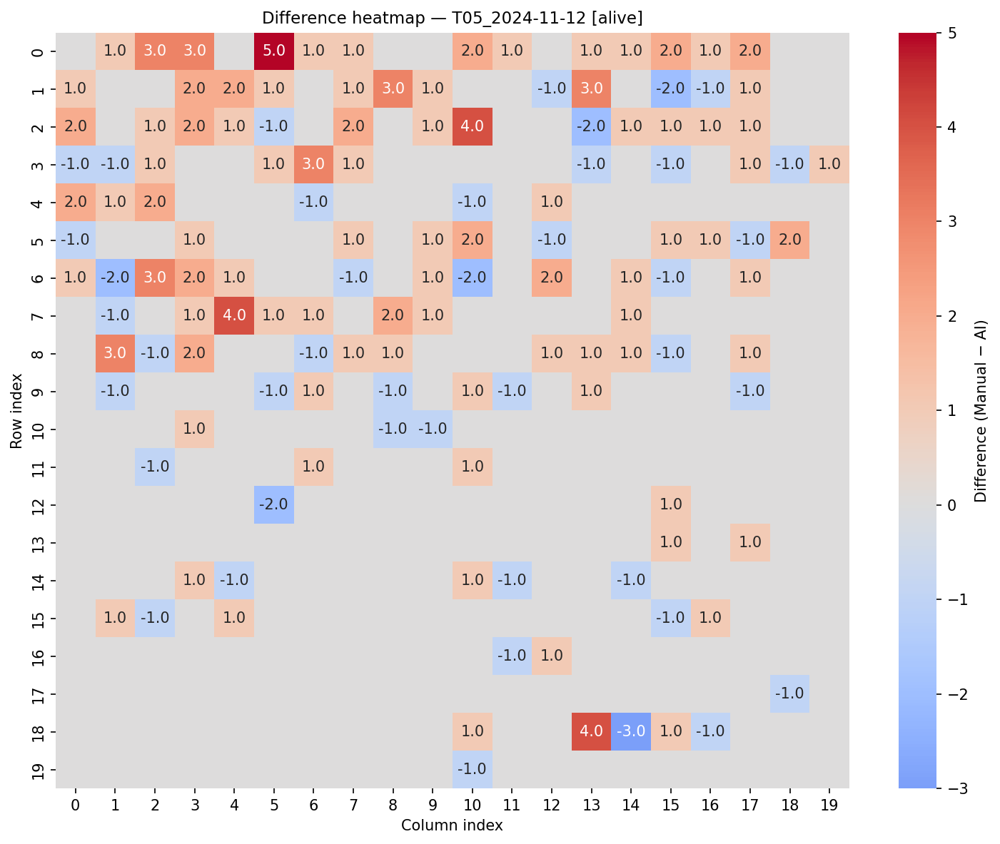

### Scatter plot

Tab-level scatter of manual count (x) vs AI count (y). The dashed black line is the 1:1 reference; the solid red line is the OLS regression. R² and Lin's CCC are annotated.

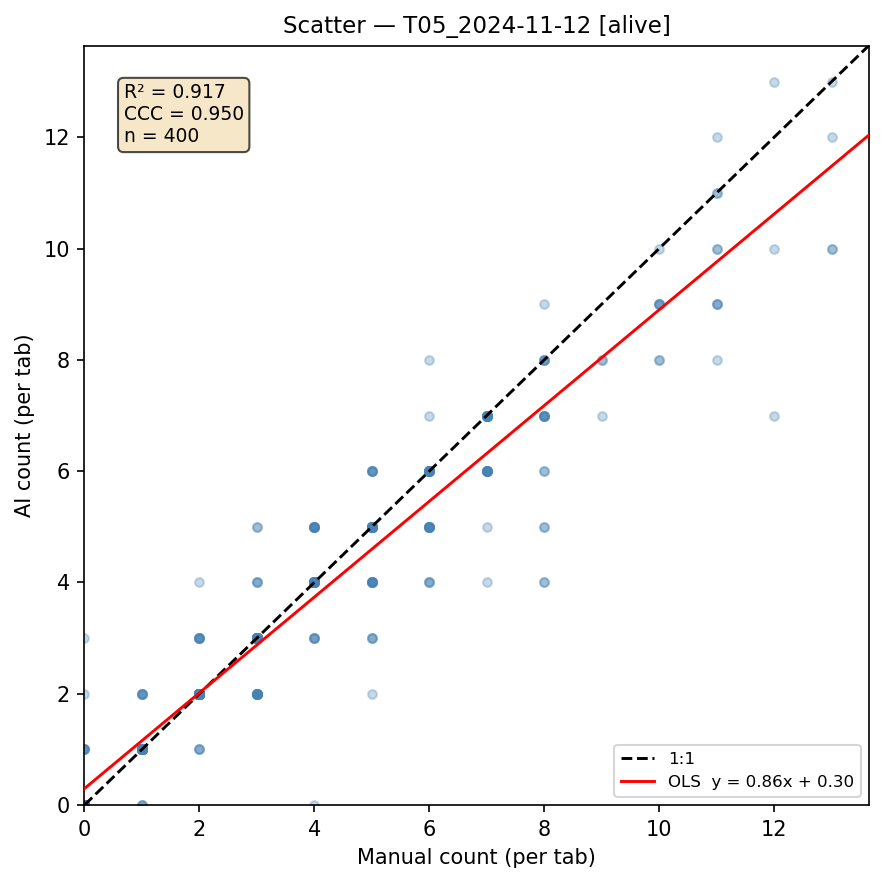

### Bland-Altman plot

Tab-level difference (manual − AI) plotted against the tab-level mean. The solid black line marks the bias; red dashed lines mark the 95% limits of agreement (bias ± 1.96 SD). If proportional bias is significant (p < 0.05), a green regression line is overlaid to show how the error scales with coral density.

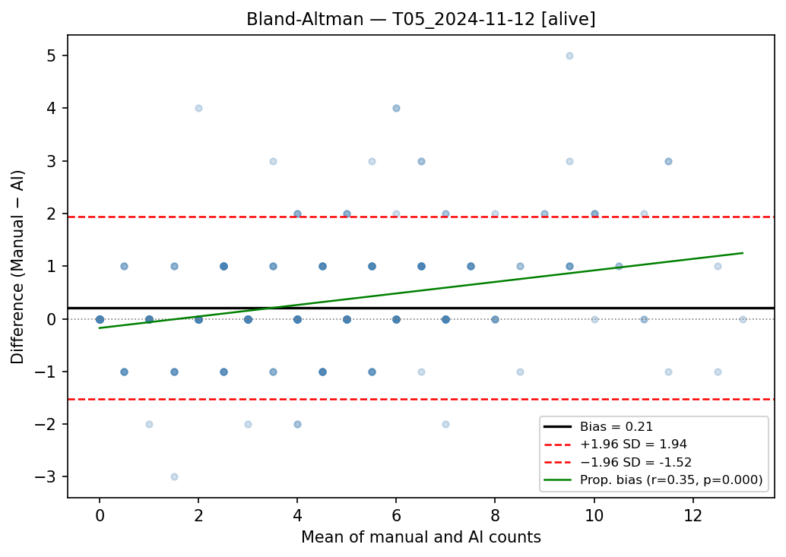

### Difference histogram

Frequency distribution of per-tab (manual − AI) values with the mean marked in red. SD, n, and range are annotated.

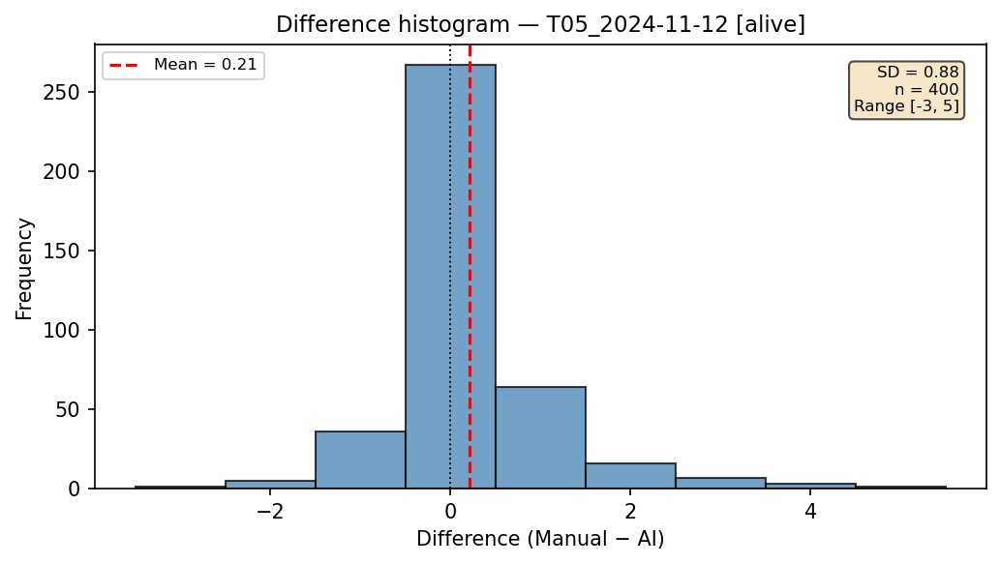

---

## Aggregate figures

Aggregate figures pool data across all matched pairs.

### Combined histogram — by tile

Pooled per-tab (manual − AI) differences across all pairs, with each tile's contribution shown as a stacked colour segment. The tile display label is derived from the AI filename stem (e.g. `2025Dec-982091078941976`), so one colour appears per tile.

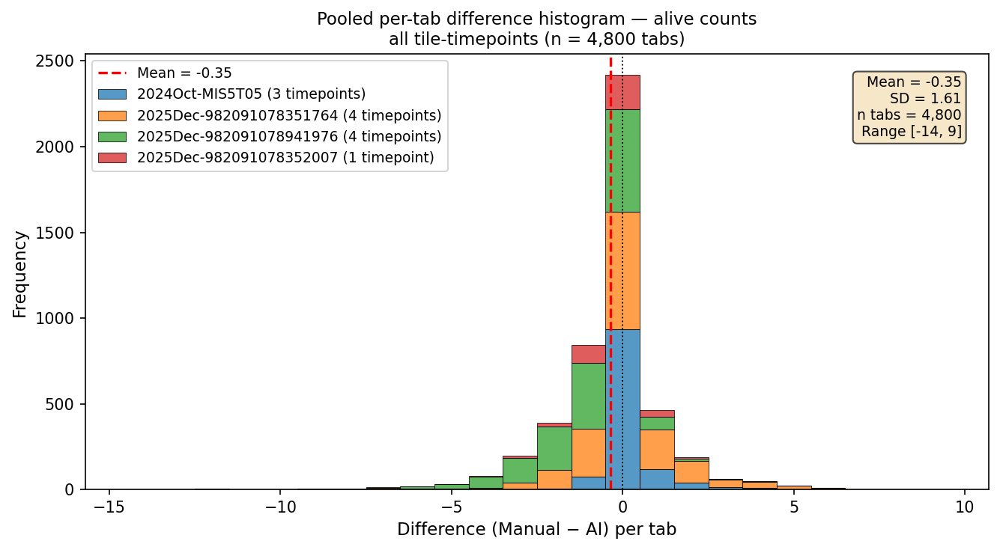

### Combined histogram — by species

The same pooled differences split into one subplot per coral species. Each subplot stacks the contributing tiles with consistent colours and a shared x-axis range, allowing direct comparison of AI accuracy across species.

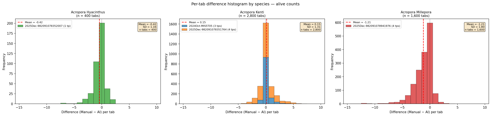

### Combined scatter

All tab-level counts from every matched pair, coloured by tile group (T05 = blue, Tile ID = orange). A single OLS regression and CCC value is computed across the pooled data.

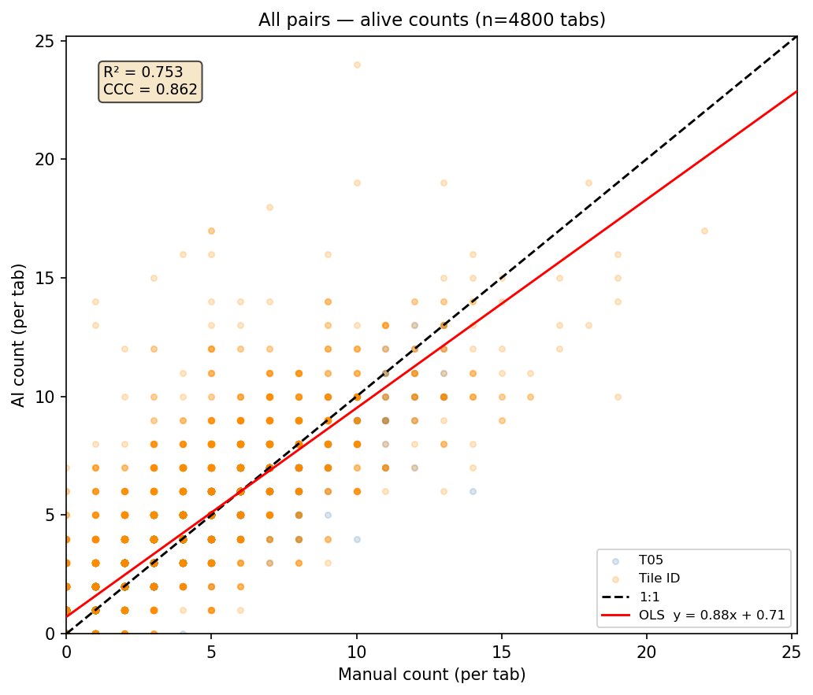

### Combined Bland-Altman

Pooled Bland-Altman across all pairs, coloured by tile group. Bias and LoA are computed from all tabs simultaneously.

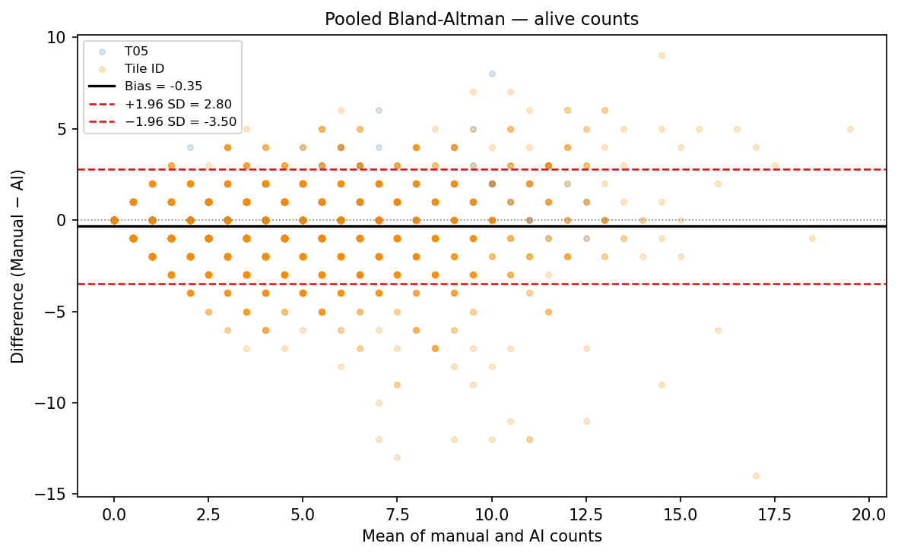

### Spatial average error

Average (manual − AI) difference at each grid position across all tile-timepoints. Systematic spatial patterns in this heatmap indicate regions where the AI model consistently over- or undercounts, which can be used to diagnose imaging artefacts or tile coverage issues.

Also generated separately for T05 and Tile ID groups.

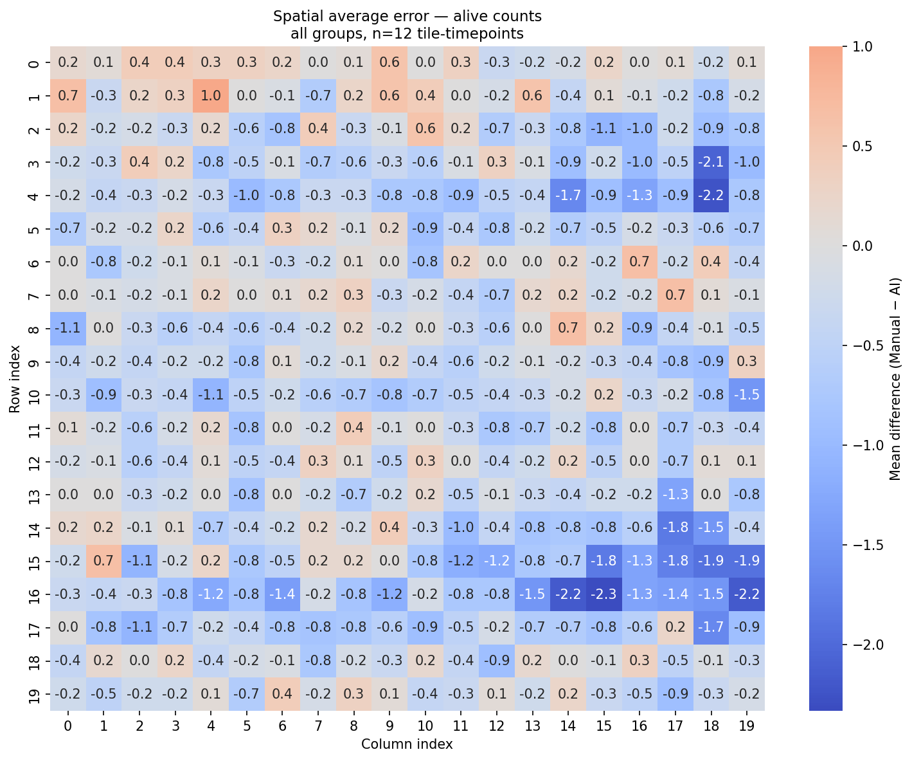

### Time histories — combined

One subplot per tile in a single figure showing total alive coral count over time for manual (solid circles) and AI (dashed squares). The x-axis is days since the first count for that tile (proxy for settlement age).

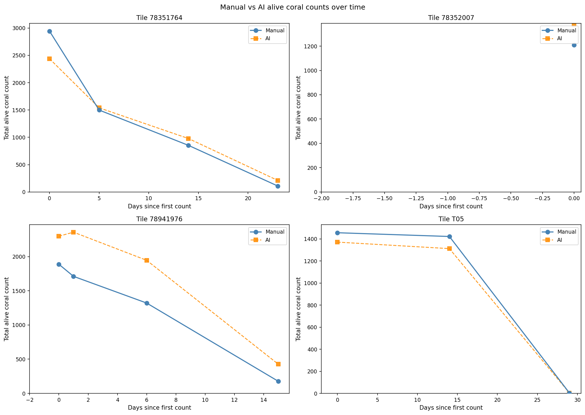

### Time histories — per tile

One dedicated figure per tile (`time_histories_<tile_id>.png`) with the title showing the full tile label (AI file stem), coral species, and spawning season.

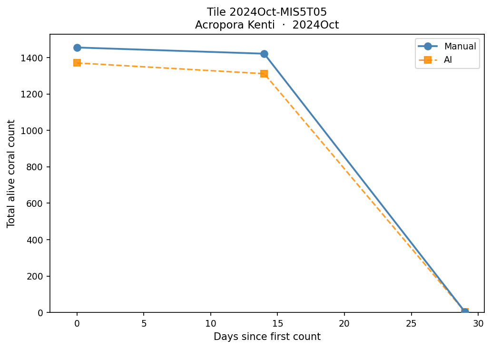

A companion JSON file (`time_histories_<tile_id>.json`) is also written for each tile, containing all data needed to recreate or replot the figure independently:

```json
{
  "tile_id":    "T05",
  "tile_label": "2024Oct-MIS5T05",
  "species":    "acropora kenti",
  "season":     "2024Oct",
  "n_cells":    400,
  "timepoints": [
    {
      "date":             "2024-11-12",
      "days_since_first": 0,
      "manual_total":     1456.0,
      "ai_total":         1371.0,
      "manual_err":       60.05,
      "ai_err":           53.94
    }
  ]
}
```

`manual_err` and `ai_err` are the spatial standard deviation of per-tab counts propagated to the tile total (`std_tab × √n_tabs`). They are stored in the JSON for reference but are not shown in the plots.

### Growth trend

Total alive coral count per tile over time for both manual (solid) and AI (dashed). Shows whether the AI accurately tracks colony growth trajectories across time points.

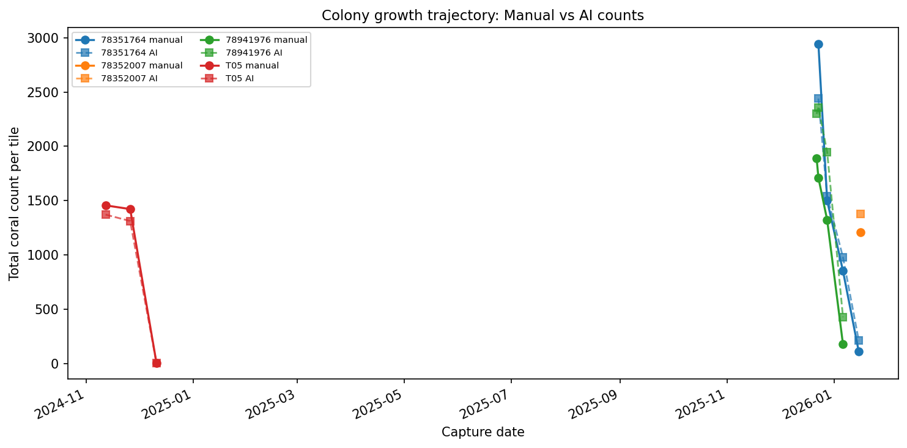

---

## Summary table

`summary_table.csv` is written to the output root. Each row is one tile × timepoint × count type. Example (selected columns):

| Tile | Group | Species | Season | Date | Count type | Manual total | AI total | Diff (%) | Bias | Lin's CCC | ±1 agree | Wilcoxon p |
|---|---|---|---|---|---|---|---|---|---|---|---|---|
| T05 | T05 | acropora kenti | 2024Oct | 2024-11-12 | alive | 1456 | 1371 | 5.84 | 0.212 | 0.950 | 91.8% | 0.0000 |
| T05 | T05 | acropora kenti | 2024Oct | 2024-11-26 | alive | 1422 | 1312 | 7.74 | 0.275 | 0.931 | 90.5% | 0.0000 |
| 982091078941976 | Tile ID | acropora millepora | 2025Dec | 2025-12-22 | alive | 1888 | 2298 | −21.72 | −1.025 | 0.797 | 66.5% | 0.0000 |
| 982091078941976 | Tile ID | acropora millepora | 2025Dec | 2026-01-06 | dead | 601 | 427 | 28.95 | 0.435 | 0.341 | 68.2% | 0.0000 |

---

## Module overview

```
manual_comparison/
├── __init__.py              # public API exports
├── manual_comparison.py     # CLI entry point and orchestration
├── data_loader.py           # sheet name parsing, AI file indexing, matrix loading
├── metrics.py               # statistical metrics (CCC, BA, agreement, Wilcoxon)
├── visualisation.py         # all matplotlib/seaborn figure functions
└── report.py                # summary table assembly and formatting
```

### `data_loader.py`

- `find_matched_pairs(manual_file, ai_dir)` — matches manual sheets to AI files by tile ID and capture date; reads `TileInfo` to populate `species` and `season` on each pair; returns matched pairs and a list of unmatched manual sheets
- `load_matrices(pair, manual_file)` — loads all four 20×20 arrays (manual alive, manual dead, AI alive, AI dead) into a `ComparisonPair` in-place; dead counts are only loaded when the sheet contains non-zero dead data

### `metrics.py`

- `compute_all_metrics(manual, ai)` — returns a flat dict of all metrics listed in the [Metrics reference](#metrics-reference) section
- `lins_ccc(x, y)` — Lin's Concordance Correlation Coefficient
- `bland_altman_stats(manual, ai)` — bias, SD, limits of agreement, proportional bias
- `agreement_rates(manual, ai)` — fraction of tabs within 0, 1, 2 counts
- `relative_errors(manual, ai)` — per-tab `(AI − manual) / manual` on non-zero manual tabs

### `visualisation.py`

Per-pair: `plot_difference_heatmap`, `plot_scatter`, `plot_bland_altman`, `plot_histogram`

Aggregate: `plot_combined_histogram`, `plot_combined_histogram_by_species`, `plot_combined_scatter`, `plot_combined_bland_altman`, `plot_spatial_average_error`, `plot_time_histories`, `plot_time_history_single`, `plot_growth_trend`

All functions accept an optional `output_path`; if provided, the figure is saved and closed. If `None`, the figure is returned for interactive display.

### `report.py`

- `build_summary_table(results)` — assembles a formatted DataFrame from a list of result dicts
- `save_summary_table(df, path)` — saves to CSV
- `print_summary_table(df)` — prints a compact console view of the key columns
